<a href="https://homenshum.github.io/">
  <picture>
    <source media="(max-width: 600px) and (prefers-color-scheme: dark)" srcset="brand/HomenShum/compact-dark.svg">
    <source media="(max-width: 600px)" srcset="brand/HomenShum/compact-light.svg">
    <source media="(prefers-color-scheme: dark)" srcset="brand/HomenShum/banner-dark.svg">
    
  </picture>
</a>

<a href="https://homenshum.github.io/">homenshum.github.io</a> · <a href="https://github.com/HomenShum">GitHub profile</a>

Source for [homenshum.github.io](https://homenshum.github.io/) and for the banner at the top of
every project README in the portfolio. One copy file drives both, so a project's tagline and
workflow read the same on GitHub, on the site and in a link preview.

## What it produces

| Output | Where it ends up | Built by |
|---|---|---|
| Wide banner, light and dark (1280×400 SVG) | top of each project README | `tools/brand/build.mjs` |
| Phone banner, light and dark (720-wide SVG) | same `<picture>`, under 600px | `tools/brand/build.mjs` |
| Profile cards (640×240 SVG) | the HomenShum profile README | `tools/brand/build.mjs` |
| Link-preview image (1280×640 PNG) | each repository's social preview and the site's `og:image` | `tools/brand/preview.mjs` |
| Static site, one page per project | `docs/`, served by GitHub Pages | `tools/site/build.mjs` |

## Change a project's copy

1. Edit its entry in [`tools/brand/repos.json`](tools/brand/repos.json): `eyebrow`, `tagline` (≤75 characters) and 3–5 `steps`.
2. Rebuild: `npm run brand && npm run site`.
3. Check: `npm run check` (README injector scenarios and the motion contract on every banner).
4. Refresh that repository's README block: `node tools/brand/readme.mjs <checkout> <Repo>`. It only rewrites the block between the `brand:start` and `brand:end` markers.

## Design rules this code enforces

- **Tokens, not taste.** Colours, radii and type come from NodeRoom's `src/ui/tokens.css`: terracotta accent `#D97757`, Inter, JetBrains Mono.
- **Text is outlined.** Each glyph is defined once per SVG and placed with `<use>`, so every reader sees the same type at about 30 KB per banner.
- **Every frame is complete.** Nothing animates in. A renderer that freezes the image, such as an offscreen tab, a rasteriser or a crawler, still shows the whole banner.
- **One motion recipe (rung 3, "trace").** A single accent signal runs the steps once, in order, and settles on the outcome. It is finite, and with `prefers-reduced-motion` it does not run. `tools/brand/motion-check.mjs` proves both against a real browser.
- **The site ships no client JavaScript.** Each page has its own title, description, canonical URL, Open Graph image and JSON-LD.
